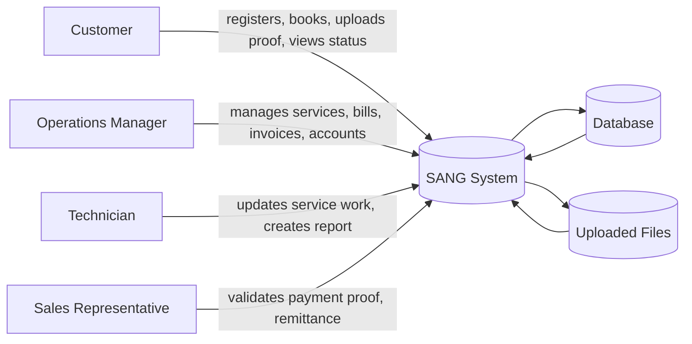
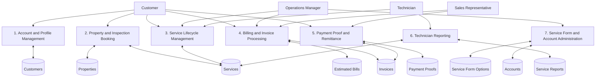
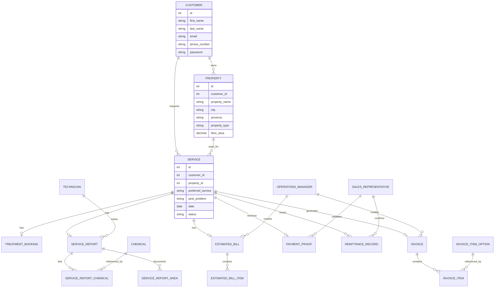

# SANG System Documentation

## 1. Purpose

SANG is a Django-based service management system for a pest control business. It supports the full operational flow from customer sign-up and property registration to service booking, inspection, treatment, billing, invoice generation, payment proof submission, remittance tracking, and technician service reporting.

The application is built as a browser-accessed information system with multiple role-based portals:

- Customer portal
- Operations Manager portal
- Technician portal
- Sales Representative portal
- Django admin site for internal administration

This document is written as a system reference for analysis, implementation planning, and AI-assisted explanation of the system’s Data Flow Diagrams, requirements, Use Case Descriptions, Entity Relationship Diagram, physical design, and maintenance plan.

## 2. System Scope

### In-Scope Functions

- Customer registration, login, profile editing, and password change
- Property registration and maintenance
- Inspection booking and service status tracking
- Estimated bill creation, viewing, editing, deletion, and confirmation
- Invoice creation, viewing, editing, deletion, and payment processing flow
- Payment proof upload and validation
- Technician service report creation and maintenance
- Chemical and treated-area logging for service reports
- Sales representative validation and remittance tracking
- Role account management for technicians, sales representatives, and customers
- Service form option maintenance for configurable dropdown values

### Out-of-Scope Functions

- Native mobile application
- Separate desktop client
- Public API layer
- Automated online payment gateway integration

## 3. Technology Stack

### Current Codebase Stack

- Programming language: Python
- Web framework: Django 6.x
- Database layer: Django ORM
- Local database default: SQLite (`db.sqlite3`)
- Optional deployment database: MySQL via `PyMySQL` when `USE_MYSQL=1`
- PDF generation: `reportlab`
- File upload handling: Django `FileField`
- Static and template rendering: Django templates with app-level template discovery

### Deployment Recommendation

For production use, the most practical stack is:

- Backend application: Django
- Application server: Gunicorn or uWSGI
- Reverse proxy/web server: Nginx or Apache
- Database: MySQL
- File storage: local disk for small deployments or object storage for uploads and backups
- Host: VPS, cloud VM, or managed Python hosting platform

### Why This Stack Fits the System

- Django fits the app’s role-based workflow and rapid CRUD-heavy operations.
- The ORM simplifies model-driven data design and relational integrity.
- MySQL is appropriate for multi-user transactional records such as services, billing, and remittance.
- ReportLab supports the PDF documents required for bills, invoices, and reports.
- Nginx or Apache is appropriate for serving static assets and reverse proxying to the Python app server.

## 4. Major Roles and Actors

### Primary Human Actors

- Customer: registers, books inspections, views service progress, uploads payment proof, and views bills and reports.
- Operations Manager: manages bookings, creates estimated bills and invoices, books treatments, updates service state, manages service forms, and manages accounts.
- Technician: updates service progress and creates service reports after treatment work.
- Sales Representative: validates payment proofs and handles remittance-related records.

### Supporting System Actor

- Django admin: internal record administration and direct database-backed management.

## 5. Functional Overview

### Customer Portal

The customer portal handles account and service lifecycle activities:

- Create customer account with email and phone validation
- Log in and maintain a session-based identity
- Register one or more properties under a customer account
- Book an inspection using a property, preferred service, pest problem, date, and time slot
- View service lifecycle status
- Review estimated bills and invoices when generated
- Upload payment proof for pending payment scenarios

### Operations Manager Portal

The operations manager portal controls the operational pipeline:

- Review incoming bookings and inspect service records
- Move services through workflow states such as For Confirmation, For Inspection, Ongoing Inspection, Estimated Bill Created, For Treatment, Ongoing Treatment, Pending Payment, Payment Confirmed, Completed, and Cancelled
- Create and edit estimated bills and invoices
- Book treatments after inspection or billing steps
- Manage service form option values used in dropdowns and configurable fields
- Manage technician accounts and sales representative accounts
- Monitor service reports and remittance records

### Technician Portal

The technician portal supports field work documentation:

- View assigned or available service records
- Update service status during inspection or treatment work
- Create service reports with chemicals used and treated areas
- Edit and delete service reports when corrections are needed

### Sales Representative Portal

The sales representative portal supports payment verification and revenue control:

- Review uploaded payment proofs
- Validate or reject proof submissions
- Create remittance records tied to payment confirmation
- View invoice-related payment context

## 6. Main Data Entities

The data model is centered on the Service record. Supporting entities extend the service lifecycle and billing workflow.

### Core Entities

- Customer: account holder and owner of properties and service requests
- Property: service location owned by a customer
- Service: inspection and treatment workflow record tied to one customer and one property
- TreatmentBooking: treatment scheduling history for a service
- ServiceReport: technician report for a service
- EstimatedBill: billing estimate tied one-to-one to a service
- EstimatedBillItem: line items inside an estimated bill
- Invoice: final billing record tied to a service
- InvoiceItem: line items inside an invoice
- PaymentProof: uploaded payment evidence tied to a service and invoice
- RemittanceRecord: accounting/validation record tied to payment proof and invoice

### Support Entities

- OperationsManager: operations account table
- Technician: technician account table
- SalesRepresentative: sales account table
- Chemical: inventory or chemical master list used in reports
- ServiceReportChemical: chemical usage details in a service report
- ServiceReportArea: treated area details in a service report
- InvoiceItemOption: selectable invoice item master data
- ServiceFormOption: configurable option table for inspection, treatment, report, and payment forms

## 7. Data Flow Diagrams

### 7.1 Context Diagram

### 7.2 Level 1 Data Flow

## 8. Use Case Descriptions

### 8.1 Customer Use Cases

#### UC-01 Register Account

- Actor: Customer
- Goal: Create a customer account
- Preconditions: Customer does not already exist with the same email or phone number
- Main flow:
  - Customer enters first name, last name, email, phone number, password, and confirmation password.
  - System validates required fields and uniqueness.
  - System creates the customer record and starts a session.
- Postconditions: Customer account exists and can be used for login

#### UC-02 Register Property

- Actor: Customer
- Goal: Add a property to be used for service requests
- Main flow:
  - Customer enters property name, complete address, property type, and floor area.
  - System stores the property under the customer account.
- Postconditions: Property becomes available for booking

#### UC-03 Book Inspection

- Actor: Customer
- Goal: Request pest control inspection
- Main flow:
  - Customer selects a property, preferred service, pest problem, date, and time slot.
  - System creates a Service record with status For Confirmation.
- Postconditions: Service request enters the operational queue

#### UC-04 View Service Status

- Actor: Customer
- Goal: Monitor the lifecycle of an active service request
- Main flow:
  - Customer opens the service status page.
  - System shows active service records and related billing/report information when available.

#### UC-05 View and Confirm Estimated Bill

- Actor: Customer
- Goal: Review and acknowledge estimated billing
- Main flow:
  - Customer opens the estimated bill linked to a service.
  - System displays bill items, totals, and service details.
  - If confirmation is required, customer can confirm the estimate.

#### UC-06 Submit Payment Proof

- Actor: Customer
- Goal: Upload evidence of payment for validation
- Main flow:
  - Customer uploads proof file and enters bank, reference number, and amount details.
  - System saves the proof with status For Validation.

### 8.2 Operations Manager Use Cases

#### UC-07 Review and Update Service Status

- Actor: Operations Manager
- Goal: Control the booking-to-treatment workflow
- Main flow:
  - OM opens the service queue.
  - OM updates service state to the next allowed step.
  - System persists the status change and any confirmed date or time fields.

#### UC-08 Create Estimated Bill

- Actor: Operations Manager
- Goal: Produce a cost estimate for a service
- Main flow:
  - OM selects a service and adds billing line items.
  - System creates an EstimatedBill and EstimatedBillItem records.
  - System sends a customer notification email.

#### UC-09 Create Invoice

- Actor: Operations Manager
- Goal: Produce the final invoice for a service
- Main flow:
  - OM selects a service and adds invoice items.
  - System creates Invoice and InvoiceItem records.
  - Service status moves to Pending Payment.
  - System sends a customer notification email.

#### UC-10 Manage Accounts

- Actor: Operations Manager
- Goal: Create, edit, and deactivate service staff accounts
- Main flow:
  - OM creates or edits technician and sales representative records.
  - System stores account changes in the corresponding tables.

### 8.3 Technician Use Cases

#### UC-11 Update Service Status

- Actor: Technician
- Goal: Mark field work progression
- Main flow:
  - Technician opens assigned service records.
  - Technician updates the service state when inspection or treatment work progresses.

#### UC-12 Create Service Report

- Actor: Technician
- Goal: Document chemicals used and treated areas
- Main flow:
  - Technician selects a service.
  - Technician enters chemical usage rows and treated area rows.
  - System saves a ServiceReport with related detail tables.

### 8.4 Sales Representative Use Cases

#### UC-13 Validate Payment Proof

- Actor: Sales Representative
- Goal: Review uploaded payment evidence
- Main flow:
  - Sales representative opens proof submissions.
  - Representative validates or rejects a proof.
  - System records validation metadata and may create a remittance record.

## 9. Requirements

### 9.1 Functional Requirements

- The system shall allow customer account creation and login.
- The system shall allow customers to create and manage properties.
- The system shall allow customers to book inspections using a property and schedule data.
- The system shall allow operations managers to update service workflow status.
- The system shall allow operations managers to create, edit, and delete estimated bills.
- The system shall allow operations managers to create, edit, and delete invoices.
- The system shall allow customers to upload payment proof files.
- The system shall allow sales representatives to validate payment proof records.
- The system shall allow technicians to create service reports.
- The system shall store chemicals, treated areas, and invoice/billing options as relational records.
- The system shall generate printable PDF documents for bills, invoices, and reports.

### 9.2 Non-Functional Requirements

- The system should support role-based access through server-side session management.
- The system should preserve relational consistency through foreign keys and one-to-one constraints.
- The system should be maintainable through configurable service form options.
- The system should be deployable on standard Python hosting infrastructure.
- The system should handle file uploads safely and keep a separate upload directory.
- The system should be understandable and testable through clear workflow state transitions.

## 10. Entity Relationship Diagram

### ERD Notes

- A customer can own many properties.
- A customer can request many services.
- Each service belongs to one property.
- Each service can have one estimated bill, one payment proof, one service report, and many invoices or treatment bookings depending on the workflow stage.
- Estimated bills and invoices are line-item based.
- Service reports are detail-rich records with chemical usage and treated area rows.
- Payment proof is stored with file metadata in the database and the physical file in the upload directory.

## 11. Physical Design

### 11.1 Database Design

The system uses relational tables with the following important design rules:

- Primary keys are automatically generated numeric IDs.
- Foreign keys enforce parent-child relationships.
- One-to-one relationships are used where a service should have only one final record of a type, such as one estimated bill or one payment proof.
- One-to-many relationships are used for detail rows such as bill items, invoice items, chemicals, and treated areas.
- Unique constraints prevent duplicate invoice records per service and duplicate customer email/phone values.

### 11.2 Storage Layout

- Source code: Django project root and `sangapp/`
- Templates: `sangapp/templates/`
- Static assets: `sangapp/static/` and collected static output during deployment
- Uploaded payment proofs: `payment_proofs/`
- Local development database: `db.sqlite3`
- Production database: MySQL schema named `sangapp_db` when enabled

### 11.3 Important Configuration Behavior

- The app can run against SQLite by default.
- Setting `USE_MYSQL=1` switches the database engine to MySQL through `PyMySQL`.
- Session handling is used for role identity and access control.
- CSRF protection is enabled in Django middleware.
- Time zone is set to `Asia/Manila`.

## 12. Important Functions and Logic Areas

The following functions and structures are important for understanding how the system works.

### 12.1 View and Workflow Functions

- `signup`: creates customer accounts.
- `login` and `logout`: manage session sign-in and sign-out.
- `profile`, `edit_profile`, `change_password`: handle customer self-service account maintenance.
- `register_property`, `edit_property`, `delete_property`: manage customer properties.
- `book_inspection`: creates service requests.
- `service_status`: shows customer-facing service progress.
- `customer_view_estimated_bill`: displays estimate details.
- `customer_confirm_estimated_bill`: confirms an estimate.
- `customer_view_invoice`: displays invoice details.
- `submit_payment_proof`: uploads proof-of-payment files and metadata.
- `om_home`, `om_service_status`, `om_update_service_status`: manage operations workflow.
- `om_create_estimated_bill`, `om_edit_estimated_bill`, `om_delete_estimated_bill`: manage estimates.
- `om_create_invoice`, `om_edit_invoice`, `om_delete_invoice`: manage invoices.
- `om_book_treatment`: schedules treatment work.
- `technician_create_service_report`, `edit_service_report`, `delete_service_report`: manage service report records.
- `sales_representative_review_payment_proof`: validates or rejects payment submissions.
- `remittance_record_details`: displays remittance metadata.

### 12.2 Model Logic

- `Service.treatment_summary`: derives a readable treatment label from bill items, invoice items, or treatment booking history.
- `EstimatedBill.total_amount`: sums bill line totals.
- `Invoice.total_amount`: sums invoice line totals.
- `EstimatedBillItem.line_total` and `InvoiceItem.line_total`: compute row totals.
- `ServiceFormOption` and `_ensure_service_form_default_options`: keep configurable option data synchronized.

### 12.3 Supporting Logic

- `CustomerRegistrationForm`: validates required fields, email uniqueness, phone uniqueness, phone format, and password confirmation.
- `role_display_ids`: maps session IDs to human-readable display IDs for role views.
- `_build_service_form_default_options`: prepares the default dropdown and reference data used by service forms.
- `_get_active_service_form_option_values`: retrieves active configurable option values for forms.

## 13. Workflow Summary by Business Process

### 13.1 Booking and Inspection

1. Customer registers or logs in.
2. Customer registers a property.
3. Customer books an inspection.
4. Service is created with status For Confirmation.
5. Operations manager reviews the request.
6. Service is advanced to For Inspection and later Ongoing Inspection as work progresses.

### 13.2 Estimation and Treatment

1. Operations manager creates an estimated bill after inspection.
2. Customer reviews the estimated bill.
3. Operations manager books treatment when needed.
4. Service moves into treatment-related statuses.
5. Technician performs treatment and creates the service report.

### 13.3 Invoicing and Payment

1. Operations manager creates the invoice.
2. Service moves to Pending Payment.
3. Customer uploads payment proof.
4. Sales representative validates the proof.
5. Remittance record is created for confirmation and tracking.

## 14. Backup and Restore Plan

### 14.1 Backup Frequency

Recommended backup schedule:

- Database backup: daily full backup
- File upload backup: daily synchronization of the `payment_proofs/` directory
- Configuration backup: after every deployment or configuration change
- Extra backup before migrations, major releases, or data correction jobs

### 14.2 Responsible Person

The Operations Manager or designated system administrator should be responsible for ensuring backups occur, with technical execution handled by the developer, system admin, or hosting provider automation.

### 14.3 Technology Requirements

- Database dump tooling:
  - MySQL: `mysqldump`
  - SQLite: file-level copy or `sqlite3` backup command
- File synchronization tooling:
  - `rsync`, cloud sync, S3-compatible storage sync, or backup agent
- Off-site backup destination:
  - cloud bucket, secure NAS, or separate server
- Retention policy:
  - at least 30 daily backups and 3 monthly snapshots for production

### 14.4 Restore Procedure

1. Stop the application or place it in maintenance mode.
2. Restore the latest database dump to the target database server.
3. Restore the `payment_proofs/` directory and any other uploaded media.
4. Reapply migration state only if the schema version requires it.
5. Verify login, service records, bills, and uploaded proof files.
6. Restart the application server and web server.

### 14.5 Backup Safety Notes

- Backups should be encrypted at rest when stored off-site.
- At least one backup copy should be isolated from the production host.
- Restore drills should be tested periodically to confirm that backups are usable.

## 15. User Support and Systems Maintenance

### 15.1 User Support Plan

Recommended support channels:

- Email support for non-urgent issues
- Phone or chat support for operational incidents
- Ticket logging for traceability of defects and requests

Support categories:

- Login and access problems
- Booking and property issues
- Billing and invoice discrepancies
- Payment proof upload or validation issues
- Report and PDF generation issues

### 15.2 Maintenance Request Handling

- Requests should be recorded in a ticket list with severity, impact, and target resolution date.
- High-priority issues should be handled first if they block booking, billing, or payment workflows.
- Minor UI or content fixes can be scheduled into a routine maintenance window.

### 15.3 Suggested Maintenance Window

- Routine maintenance: weekly or biweekly during low traffic hours
- Security and dependency updates: monthly
- Emergency fixes: as soon as possible when workflow integrity is affected

### 15.4 Support Duration

For a project implementation, a practical support period is:

- Active post-deployment support: 1 to 3 months
- Extended maintenance: ongoing, if the system remains in use

## 16. Installation Strategy

### 16.1 Recommended Strategy

Use a staged installation strategy:

1. Prepare the server environment.
2. Install Python and required packages.
3. Configure the database.
4. Apply migrations.
5. Create initial accounts and seed configurable data.
6. Test the complete workflow in staging.
7. Deploy to production behind a web server and application server.

### 16.2 Activities to Perform

- Set up a Python virtual environment.
- Install dependencies from `requirements.txt`.
- Configure environment variables such as database credentials and `USE_MYSQL`.
- Run migrations.
- Load initial service form options and master data if needed.
- Create admin and role accounts.
- Verify file upload permissions for payment proof storage.
- Validate PDF generation, email notifications, and login flows.

### 16.3 Deployment Order

1. Build and test locally.
2. Deploy to staging.
3. Verify role workflows end-to-end.
4. Cut over to production.
5. Monitor logs, uploads, and database health.

## 17. Storage Estimate for the Next 2 Years

### 17.1 Current Footprint

Based on the current repository database, the local footprint is very small:

- `db.sqlite3`: about 401 KB
- `payment_proofs/`: about 288 KB

Current combined footprint is under 1 MB, but that is only the starting point. The real growth comes from additional service records, proof uploads, and backup copies.

### 17.2 Estimate Assumptions

For a modest 2-year operational window, assume:

- 500 services per year
- 1 payment proof for most paid services
- Average payment proof size: 2 MB
- Average PDF and generated artifact overhead: 0.25 MB per service
- Database record growth per complete service lifecycle: about 25 KB including related billing and report rows

### 17.3 Computation

For 2 years:

- Services: 1,000
- Payment proofs: 1,000 × 2 MB = 2,000 MB
- Generated PDFs and artifacts: 1,000 × 0.25 MB = 250 MB
- Database growth: 1,000 × 0.025 MB = 25 MB
- Operational buffer and index overhead: about 25% = 569 MB

Estimated minimum active storage:

$$
2{,}000\text{ MB} + 250\text{ MB} + 25\text{ MB} + 569\text{ MB} \approx 2{,}844\text{ MB}
$$

### 17.4 Storage Recommendation

- Minimum practical active storage: 3 GB
- Recommended production storage: 5 GB
- If keeping one full on-host backup copy: allocate at least 6 GB total

### 17.5 Interpretation

The live database itself is not the major consumer of space. File uploads, especially payment proof images or scans, are the main driver. If the organization expects larger image files or keeps long backup retention on the same host, the storage should be increased accordingly.

## 18. Web, Stand-Alone, and Mobile Classification

### 18.1 Application Type

The application is web-based, not stand-alone.

### 18.2 Mobile Access

There is no separate native mobile app in the codebase. However, the system can still be used on mobile browsers if the template layout is responsive enough for the device width.

### 18.3 Implications

- Users access the system through a browser.
- Server-side rendering simplifies access across devices.
- A future mobile app could reuse the same data model and workflow logic, but it is not part of the current implementation.

## 19. Current Implementation Notes and Limitations

- The system uses custom role tables rather than Django’s built-in auth models for the operational roles.
- Passwords are stored in role tables instead of being managed through Django’s standard user-password hashing flow.
- This is workable for a school project or prototype, but production hardening should move toward stronger authentication and secret handling.
- Some views in the codebase are placeholders or less fully implemented than the main booking, billing, and reporting flows.

## 20. Summary

SANG is a role-driven pest control operations platform built on Django. Its core value is operational traceability: every service request can move through inspection, treatment, billing, payment, and reporting while preserving data for customers, operations managers, technicians, and sales representatives.

The schema is centered on `Service`, with one-to-one and one-to-many child tables for estimates, invoices, payments, and reports. This design makes the system suitable for explaining workflow-based diagrams, entity relationships, and maintenance planning.

For implementation, the best fit is a browser-based Django deployment using Python, MySQL in production, and a standard Linux web stack with scheduled backups and off-site file protection.